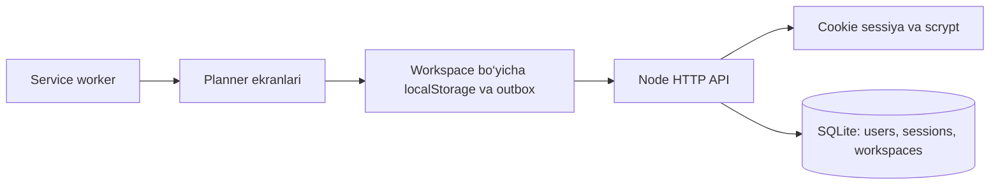

# Arxitektura

Native JavaScript ES modullari tanlandi: asl ilova qayta yozilmasdan barcha biznes qoidalarini saqlash mumkin. Vite frontendni bitta production bundle va CSS’ga yig‘adi. Node HTTP server shu bundle va JSON API’ni bir origin’da beradi. SQLite fayl diskda saqlanadi.

## API

| So‘rov | Vazifa |
| --- | --- |
| GET /api/health | Server healthcheck |
| GET /api/session | Workspace, foydalanuvchi va CSRF token |
| GET /api/state | Workspace ma’lumotlari va revision |
| PUT /api/state | Tekshirilgan qisman o‘zgarishlarni yozish |
| POST /api/state/reset | Faqat joriy workspace’ni reset qilish |
| POST /api/auth/register | Hisob yaratish va guest rejalarini biriktirish |
| POST /api/auth/login | Hisobga kirish |
| POST /api/auth/logout | Hisobdan chiqish va yangi guest workspace |

Yozish so‘rovlari JSON, to‘g‘ri Origin va `X-CSRF-Token` talab qiladi. State yozishlarida revision tekshiriladi. Eski revision 409 qaytaradi va server nusxasini beradi. Offline outbox faqat serverda asl qiymat o‘zgarmagan kalitlarni avtomatik qayta yuboradi. Bir xil kalitning parallel o‘zgarishlari foydalanuvchi tanlovini talab qiladi. Conflict butun ma’lumot turi (masalan, completions yoki templates) bo‘yicha hal qilinadi; maydon darajasidagi merge mavjud emas.

Cache va outbox workspace ID bilan ajratiladi. API javoblari va hisob ma’lumotlari service worker’da keshlanmaydi. Active Pomodoro va Study Flow shu qurilma cache’ida qoladi. Hisob sessiyasi 30 kun amal qiladi. Password recovery va email verification bu versiyada mavjud emas.

Database sxemasi `server/database.mjs` ichida, `PRAGMA user_version=1` bilan belgilangan. Kelajakdagi sxema o‘zgarishlariga versiyalangan migratsiya qo‘shish kerak. Hozirgi saqlash bitta server instansiyasi uchun mo‘ljallangan.

Asosiy texnologiyalar: [Node SQLite](https://nodejs.org/api/sqlite.html), [Vite](https://vite.dev/guide/). Node 24’da SQLite moduli experimental warning chiqarishi mumkin.
